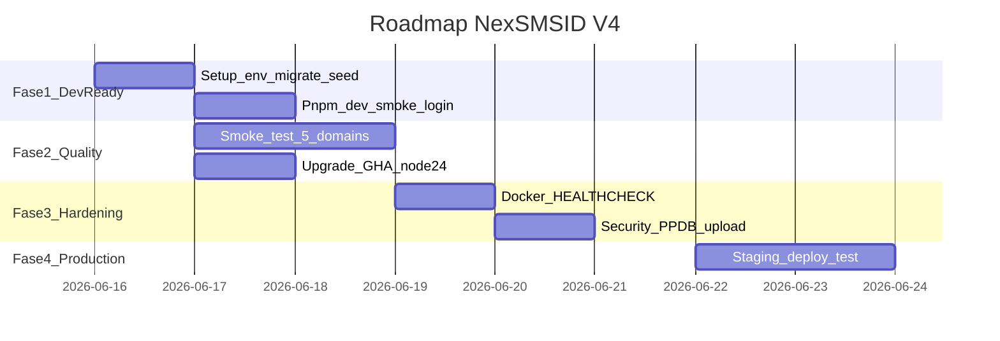

# Roadmap — NexSMSID V4 (post-audit 2026-06-15)

> **Update 2026-06-16:** Fase 1–3 ✅ · Fase 4 prod pilot jalan · backlog & fase aktif → [STATUS.md](../workflow/STATUS.md)

Berdasarkan [REPORT-2026-06-15.md](REPORT-2026-06-15.md).



---

## Fase 1 — Dev Ready (Hari 1–2) — **PRIORITAS SEKARANG**

**Tujuan:** Developer bisa login dan navigasi dasar.

```bash
cp .env.example .env
# Isi JWT_ACCESS_SECRET & JWT_REFRESH_SECRET (openssl rand -base64 64)
docker compose up -d                    # project: nexsmsid-v4
pnpm --filter @nexsmsid/api prisma migrate dev
pnpm --filter @nexsmsid/api prisma db seed
pnpm dev
```

**Exit criteria:**
- [ ] `GET /api/v1/health` → 200
- [ ] Login `superadmin@nexsmsid.dev` / `ChangeMe123!`
- [ ] Dashboard `/admin` tampil

---

## Fase 2 — Quality & Coverage (Hari 3–5)

**Tujuan:** Validasi bisnis end-to-end.

| Domain | Halaman uji | Alur |
|--------|-------------|------|
| Master data | `/admin/master-data/departments` | CRUD 1 record |
| People | `/admin/students` | Create → list |
| Akademik | `/admin/academic/schedules` | View jadwal |
| Keuangan | `/admin/finance/invoices` | List tagihan |
| PPDB | `/ppdb/register` + `/admin/ppdb` | Daftar → verifikasi |
| Portal | `/teacher`, `/student`, `/guardian` | Login per role |

**Paralel — CI maintenance:**
- [ ] Upgrade `actions/checkout`, `setup-node`, `pnpm/action-setup` ke versi Node 24-ready
- [ ] Fix moderate npm vulnerability jika tersedia patch

**Exit criteria:**
- [ ] 5 domain lolos smoke test
- [ ] Tidak ada bug blocker di alur login/CRUD

---

## Fase 3 — Hardening (Hari 6–8)

**Tujuan:** Production readiness.

| Task | File | Detail |
|------|------|--------|
| Dockerfile HEALTHCHECK | `Dockerfile.api`, `Dockerfile.web` | Tambah instruction setara compose healthcheck |
| PPDB upload review | `apps/api/src/public-ppdb/` | MIME, size, path sandbox |
| Deprecated cleanup | `apps/web/src/lib/auth-storage.ts` | Hapus fungsi legacy |
| Staging healthcheck | `scripts/staging-healthcheck.sh` | Jalankan setelah deploy lokal prod compose |

**Exit criteria:**
- [ ] `docker-audit.sh` → 0 FAIL, minimal WARN
- [ ] Security review PPDB selesai tanpa critical

---

## Fase 4 — Production Pilot (Hari 9–12)

```bash
# .env production lengkap (Turnstile wajib)
pnpm docker:prod:build
pnpm docker:prod:up
pnpm db:migrate:prod
pnpm health
```

**Exit criteria:**
- [ ] Stack prod jalan (postgres, redis, api, web, nginx)
- [ ] HTTPS/nginx dikonfigurasi domain
- [ ] Backup `pnpm backup` teruji

---

## Prioritas cepat (jika waktu terbatas)

```
1. Setup .env + pnpm dev + login          ← hari ini
2. Smoke test admin + 1 modul             ← besok
3. Upgrade GitHub Actions (Node 24)       ← minggu ini
4. Docker HEALTHCHECK + staging deploy    ← minggu depan
```

---

## Skill yang mendukung roadmap

| Skill lokal | Dipakai di fase |
|-------------|-----------------|
| `nexsmsid-v4-workflow` | Semua fase — workflow & STATUS |
| `fullstack-project-audit` | Audit ulang kapan saja |
| `docker-compose-audit` | Fase 3 hardening |
| `nexsmsid-v4` | Semua development fitur |
