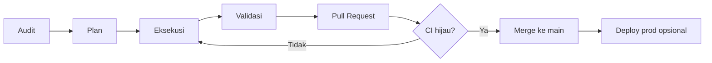

# UI Enterprise 2026 — Program Workflow

**Tujuan:** NexSMSID V4 terlihat dan terasa seperti produk **SaaS enterprise 2026** (clean, konsisten, data-dense tapi readable).

**Referensi visual:** design-in-code (UI Enterprise S1–S20 selesai; mockup PNG tidak lagi di repo).

**Prinsip:** Satu sprint = satu PR reviewable. Tidak loncat sprint. Tidak merge sebelum CI hijau.

---

## Siklus wajib per sprint (A→P→E→V→PR→M)

Setiap batch UI **harus** mengikuti urutan ini:



| Langkah | Nama | Output wajib |
|---------|------|--------------|
| **A** | **Audit** | Gap vs target 2026 + daftar file/area terdampak |
| **P** | **Plan** | Scope sprint, acceptance criteria, daftar file, tier verify |
| **E** | **Eksekusi** | Implementasi minimal diff, pola `@nexsmsid/ui` |
| **V** | **Validasi** | Quality gate lokal = mirror CI |
| **PR** | **Pull Request** | Branch `feat/ui-*` / `fix/ui-*`, body + test plan |
| **M** | **Merge** | `gh pr merge` **hanya** setelah CI hijau |

### Gate: kapan boleh lanjut?

| Dari | Ke | Syarat |
|------|-----|--------|
| Audit | Plan | Gap terdokumentasi, sprint dipilih |
| Plan | Eksekusi | Acceptance criteria jelas; user approve jika sprint besar |
| Eksekusi | Validasi | Diff fokus; tidak campur sprint lain |
| Validasi | PR | Semua check tier **Web** lulus |
| PR | Merge | GitHub Actions `NexSMSID V4 CI` ✅ |
| Merge | Deploy prod | User minta + `pnpm docker:prod:build && docker:prod:up` |

---

## Tier verify — scope Web UI

```bash
pnpm format:check
pnpm lint
pnpm typecheck
pnpm build
```

**Smoke manual** (catat di PR test plan):

- Login admin → shell + halaman sprint terlihat benar
- Mobile lebar ~390px: nav usable, tidak overflow parah
- Tidak ada regresi permission/RBAC

Scope **full** (sentuh API): tambah `pnpm --filter @nexsmsid/api test` + `pnpm validate:integration`.

---

## Design system (target 2026)

| Token | Nilai | Pemakaian |
|-------|-------|-----------|
| Emerald | `#10B981` | Primary, CTA, active nav |
| Teal | `#14B8A6` | Hero gradient, accent |
| Indigo | `#6366F1` | KPI guru, info |
| Amber | `#F59E0B` | Warning, outstanding |
| Coral | `#EF4444` | Badge notifikasi, destructive |
| Slate | `#64748B` | Secondary text |
| Gray | `#E2E8F0` | Border, grid chart |

**Komponen inti:** `Button`, `Badge`, `Card`, `StatCard`, `ChartCard`, `DataTable`, `PageHeader`, `SearchFilterBar`, `EmptyState`, `ErrorState`, shells (`admin-shell`, `portal-shell`).

**Layout:**

- Radius kartu ~12px (`rounded-xl`)
- Shadow halus (`shadow-card`, `shadow-elevated`)
- Background app: white / `slate-50` subtle
- Typography: Inter, hierarchy jelas (label uppercase kecil, angka tabular)

---

## Sprint map (UI keseluruhan)

Detail acceptance: [UI-PLAN.md](UI-PLAN.md) · Status: [STATUS.md](STATUS.md) · Roadmap: [../audit/ROADMAP.md](../audit/ROADMAP.md)

| Sprint | Area | Status |
|--------|------|--------|
| **UI-S0** | Audit + dokumentasi workflow | 🔄 aktif |
| **UI-S1** | Design tokens + `@nexsmsid/ui` polish | ⏳ |
| **UI-S2** | Admin shell (sidebar, header, mobile nav) | ⏳ |
| **UI-S3** | Admin dashboard (hero, KPI, charts, alerts) | 🟡 sebagian (#8–#10) |
| **UI-S4** | Auth (login, change-password) | ⏳ |
| **UI-S5** | Pola halaman admin (list/filter/table/form) | ⏳ |
| **UI-S6** | Portal guru / siswa / wali | ⏳ |
| **UI-S7** | Dark mode, a11y, responsive QA | ⏳ |

**Aturan:** satu PR per sprint (kecuali hotfix kecil). Update [STATUS.md](STATUS.md) setelah merge.

---

## Git & PR

| Aturan | Nilai |
|--------|-------|
| Base branch | `main` |
| Naming | `feat/ui-s1-design-system`, `feat/ui-s2-admin-shell`, … |
| Commit | Conventional: `feat(web): …`, `fix(ui): …` |
| PR body | Summary + Test plan checklist |
| Merge | `--merge` setelah `gh pr checks --watch` pass |
| Deploy prod | Setelah merge web: `pnpm docker:prod:build && pnpm docker:prod:up` |

---

## Dev vs prod preview

| Tujuan | Perintah | URL |
|--------|----------|-----|
| Develop / review UI | `pnpm dev` atau build + `next start` | `:3000` |
| Pilot production | `pnpm docker:prod:build && pnpm docker:prod:up` | nginx `:80` |

---

## Referensi

- Status program: [STATUS.md](STATUS.md) — bagian **UI Enterprise 2026**
- Checklist per sprint: [checklists/ui-enterprise-cycle.md](checklists/ui-enterprise-cycle.md)
- Skill agent: `.cursor/skills/nexsmsid-ui-enterprise/SKILL.md`
- Project workflow umum: [WORKFLOW.md](WORKFLOW.md)
