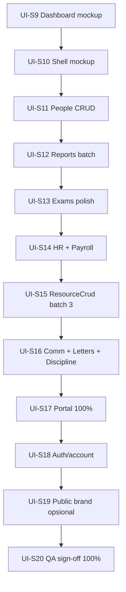

# UI Enterprise 2026 — Plan 100% Mockup Parity

**Referensi:** design-in-code (UI Enterprise S1–S20 ✅)  
**Baseline:** S1–S8 selesai (#11–#17, #18–#26) · ~**65%** keseluruhan · ~**55%** admin CRUD  
**Target:** **100%** — seluruh surface selaras mockup + pola enterprise konsisten  
**Workflow:** A→P→E→V→PR→M · satu PR per sprint · CI hijau sebelum merge

---

## Definisi “100%”

100% **bukan** pixel-perfect screenshot identik (data real ≠ mockup demo), melainkan:

| Kriteria              | Wajib                                                                                                                                |
| --------------------- | ------------------------------------------------------------------------------------------------------------------------------------ |
| **Mockup checklist**  | Semua elemen visual mockup ada di implementasi (atau variasi produk terdokumentasi)                                                  |
| **Admin 104 halaman** | Setiap halaman memakai pola enterprise **atau** wrapper resmi (`PeoplePage`, `MasterDataPage`, `ResourceCrudPage`, dashboard khusus) |
| **Portal 23 halaman** | `SectionCard` + `PageHeader`/`portal-shell` konsisten                                                                                |
| **Shell**             | Sidebar, header, mobile nav selaras mockup (termasuk opsi sidebar gelap teal)                                                        |
| **Dashboard**         | Hero, 4 KPI, 2 chart sesuai mockup (metrik + tipe chart)                                                                             |
| **Design tokens**     | `#10B981`, radius, shadow, typography — tidak ada halaman legacy `Card` mentah                                                       |
| **QA sign-off**       | Checklist manual + `pnpm prod:smoke` + tier Web lulus                                                                                |

**Di luar scope 100% admin mockup (tier opsional S19):** situs publik marketing — brand selaras, layout boleh berbeda.

---

## Gap saat ini (2026-06-17)

| Layer            | Total | Sudah enterprise                                     | Gap                                    |
| ---------------- | ----- | ---------------------------------------------------- | -------------------------------------- |
| Admin `page.tsx` | 104   | ~56 PageHeader · ~39 DataTable · ~18 SearchFilterBar | ~48 halaman belum pola penuh           |
| Portal           | 23    | 20 SectionCard                                       | 3 notifications                        |
| Public           | 14    | brand dasar                                          | polish enterprise opsional             |
| Account          | 3     | login ✅                                             | change-password/security polish        |
| Mockup dashboard | —     | hero ✅ · KPI/chart **beda konten**                  | selaraskan mockup                      |
| Mockup shell     | —     | nav ✅ · mobile ✅                                   | sidebar gelap teal, date picker header |

### Halaman admin prioritas tinggi (belum PageHeader / pola penuh)

```
admin/academic/reports
admin/bkk/reports
admin/communication/notifications
admin/communication/reports
admin/discipline/reports
admin/finance/reports
admin/ppdb/reports
+ ~30 list page tanpa SearchFilterBar (exams/*, hr/*, payroll/*, people, users, roles)
```

---

## Roadmap sprint (S9 → S20)

Estimasi: **12 PR** · **~3–4 minggu** (1 sprint/hari, CI ~5 menit)



---

## UI-S9 — Dashboard mockup parity

**Branch:** `feat/ui-s9-dashboard-mockup`  
**Effort:** M · **1 PR**

### Scope

| Mockup                                              | Aksi                                                            |
| --------------------------------------------------- | --------------------------------------------------------------- |
| Hero copy + ilustrasi gedung                        | Selaraskan teks mockup + SVG gedung mockup                      |
| KPI 4: Siswa, Guru, **Kelas**, **Total Pembayaran** | Ganti KPI 3–4; tambah badge % vs bulan lalu (API atau computed) |
| Chart: **Tren Kehadiran Siswa** (line)              | Endpoint `dashboardAcademicSummary` / data attendance monthly   |
| Chart: **Perbandingan Siswa & Guru** (grouped bar)  | Data people summary monthly                                     |
| Filter “6 Bulan Terakhir”                           | Dropdown di ChartCard action                                    |

### File

- `apps/web/src/components/dashboard/dashboard-hero.tsx`
- `dashboard-kpi-row.tsx` · `dashboard-charts.tsx` · `dashboard-types.ts`
- `apps/web/src/app/admin/(dashboard)/page.tsx`
- API client types jika perlu field baru (koordinasi backend minimal)

### Acceptance

- [ ] 4 KPI + badge % selaras mockup
- [ ] 2 chart tipe + judul selaras mockup
- [ ] Hero teks + ilustrasi selaras mockup
- [ ] Tier Web lulus

---

## UI-S10 — Admin shell mockup parity

**Branch:** `feat/ui-s10-shell-mockup`  
**Effort:** M · **1 PR**

### Scope

| Mockup                            | Aksi                                                                    |
| --------------------------------- | ----------------------------------------------------------------------- |
| Sidebar gelap teal                | Token `--sidebar` light mode → teal gelap mockup; active item highlight |
| Logo “NexAdmin School Management” | Selaraskan branding header sidebar                                      |
| Search sidebar “Cari menu…” + ⌘K  | Placeholder + shortcut hint (optional: command palette)                 |
| Header search “Cari apapun…”      | Lebar penuh + placeholder mockup                                        |
| Date picker header                | Komponen date display/filter (context dashboard atau global)            |
| Bell badge merah “3”              | Style badge mockup (count dari API notifications)                       |
| “Sembunyikan Menu”                | Label toggle sidebar selaras mockup                                     |

### File

- `apps/web/src/components/admin-shell.tsx`
- `apps/web/src/app/globals.css` (sidebar tokens)

### Acceptance

- [ ] Sidebar gelap teal di light mode (mockup)
- [ ] Header search + date + notification selaras
- [ ] Mobile bottom nav tidak regresi
- [ ] RBAC smoke: login admin, nav modul utama

---

## UI-S11 — People module enterprise

**Branch:** `feat/ui-s11-people-crud`  
**Effort:** L · **1 PR**

### Scope

Upgrade `PeoplePage` wrapper **atau** migrasi ke pola penuh:

| Halaman        | File                                     |
| -------------- | ---------------------------------------- |
| Siswa          | `admin/students/page.tsx`                |
| Guru           | `admin/teachers/page.tsx`                |
| Staff          | `admin/staffs/page.tsx`                  |
| Wali           | `admin/guardians/page.tsx`               |
| Wali per siswa | `admin/students/[id]/guardians/page.tsx` |

### Pattern wajib

`PageHeader` → `SearchFilterBar` → `SectionCard` → `DataTable` → `ErrorState` → `ConfirmDialog`

### Acceptance

- [ ] 5 halaman people konsisten visual
- [ ] SearchFilterBar + filter status/kelas
- [ ] Tidak regresi CRUD + entity picker

---

## UI-S12 — Reports module batch

**Branch:** `feat/ui-s12-reports-enterprise`  
**Effort:** M · **1 PR**

### Halaman (8)

```
admin/academic/reports
admin/bkk/reports
admin/communication/reports
admin/discipline/reports
admin/finance/reports
admin/ppdb/reports
admin/exams/reports        (polish jika belum penuh)
admin/inventory/reports    (polish jika belum penuh)
```

### Pattern

`PageHeader` + `SectionCard` + export/filter bar + chart/table report

### Acceptance

- [ ] Semua halaman `*/reports` punya PageHeader
- [ ] Layout konsisten dengan `admin/reports/page.tsx` hub

---

## UI-S13 — Exams subdomain polish

**Branch:** `feat/ui-s13-exams-enterprise`  
**Effort:** L · **1–2 PR** (split jika >400 LOC)

### Halaman

```
admin/exams/page.tsx
admin/exams/banks/page.tsx
admin/exams/[id]/schedule|sessions|results|questions|participants/page.tsx
admin/exams/create/page.tsx · edit/page.tsx (wizard polish)
```

### Acceptance

- [ ] SearchFilterBar di semua list exam
- [ ] Detail exam tabs konsisten SectionCard
- [ ] Wizard create/edit selaras exam sessions polish (#24)

---

## UI-S14 — HR + Payroll polish

**Branch:** `feat/ui-s14-hr-payroll-enterprise`  
**Effort:** M · **1 PR**

### Halaman

```
hr/employees · hr/leaves · hr/attendance
payroll/periods · runs · payslips · payments · settings · reports
```

### Acceptance

- [ ] SearchFilterBar + PageHeader di semua list
- [ ] Landing `hr/page.tsx` · `payroll/page.tsx` → ModuleCard grid konsisten

---

## UI-S15 — ResourceCrudPage batch 3

**Branch:** `feat/ui-s15-resource-crud-batch3`  
**Effort:** M · **1 PR**

Migrasi halaman master-data/simple CRUD ke `ResourceCrudPage`:

```
master-data/* (9) — audit: sudah MasterDataPage? unify ke ResourceCrud jika lebih konsisten
library/members · library/reservations
inventory/categories · inventory/locations
letters · letters/templates · letters/approvals
discipline/rules · violations · achievements
communication/templates · messages · announcements
bkk/jobs · applications · tracer-studies
industry-partners · alumni · internships
counseling/cases
```

**Target:** semua halaman CRUD sederhana pakai wrapper generik (DRY).

### Acceptance

- [ ] ≥15 halaman migrasi atau dikonfirmasi sudah MasterDataPage setara
- [ ] `coerceBooleanFields` dipakai konsisten

---

## UI-S16 — Communication + misc admin

**Branch:** `feat/ui-s16-comm-admin-enterprise`  
**Effort:** M · **1 PR**

```
admin/communication/notifications/page.tsx
admin/users/page.tsx · admin/roles/page.tsx
admin/school-profile/page.tsx
admin/reports/jobs · admin/reports/exports
admin/letters/create (polish)
admin/discipline/summary (SearchFilterBar)
```

---

## UI-S17 — Portal 100%

**Branch:** `feat/ui-s17-portal-100`  
**Effort:** S · **1 PR**

### Halaman

```
teacher/notifications/page.tsx
student/notifications/page.tsx
guardian/notifications/page.tsx
```

### Acceptance

- [ ] 23/23 portal pages SectionCard + PageHeader pattern
- [ ] Mobile bottom nav portal smoke
- [ ] Brand selaras admin emerald

---

## UI-S18 — Auth & account polish

**Branch:** `feat/ui-s18-auth-account`  
**Effort:** S · **1 PR**

```
account/change-password/page.tsx
account/security/page.tsx
account/unassigned/page.tsx
```

Selaraskan split-panel / card enterprise seperti login.

---

## UI-S19 — Public site brand (opsional tier)

**Branch:** `feat/ui-s19-public-brand`  
**Effort:** L · **1–2 PR**  
**Catatan:** Tidak wajib untuk “100% admin mockup”; wajib jika scope = seluruh web 145 halaman.

### Scope

- Header/footer publik emerald enterprise
- PPDB flow cards konsisten
- Homepage hero selaras brand NexAdmin

---

## UI-S20 — QA sign-off 100%

**Branch:** `docs/ui-s20-signoff` + fixes  
**Effort:** S · **1 PR**

### Checklist wajib lulus

**Otomatis**

```bash
pnpm format:check && pnpm lint && pnpm typecheck && pnpm build
pnpm prod:smoke
```

**Manual browser**

- [ ] Admin dashboard vs mockup side-by-side
- [ ] Sidebar gelap teal + header date picker
- [ ] Dark mode admin + portal
- [ ] Mobile 390px: admin bottom nav + portal bottom nav
- [ ] Skip link Tab → main content
- [ ] Login → change-password → portal flow

**Dokumen**

- [x] Update `STATUS.md` → UI Enterprise **100% ✅**
- [x] `pnpm prod:smoke` + browser QA (UI-S7/S20)

---

## Matriks tracking progress

Centang per sprint selesai + PR merged:

| Sprint | PR  | Admin pages | Portal   | Mockup element    |
| ------ | --- | ----------- | -------- | ----------------- |
| S9     |     |             |          | Dashboard         |
| S10    |     |             |          | Shell             |
| S11    |     | +5          |          |                   |
| S12    |     | +8          |          |                   |
| S13    |     | +10         |          |                   |
| S14    |     | +9          |          |                   |
| S15    |     | +15         |          |                   |
| S16    |     | +8          |          |                   |
| S17    |     |             | +3       |                   |
| S18    |     |             |          | Auth              |
| S19    |     |             |          | Public (opsional) |
| S20    |     | sign-off    | sign-off | All               |

**Exit 100%:** semua baris S9–S18 ✅ + S20 ✅ (S19 jika scope penuh web).

---

## Urutan eksekusi (rekomendasi)

1. **S9 + S10** dulu — impact visual terbesar vs mockup (dashboard + shell)
2. **S11–S16** paralel per domain jika multi-agent; serial jika satu developer
3. **S17–S18** portal + account
4. **S20** sign-off — jangan merge tanpa checklist

## Risiko & mitigasi

| Risiko                           | Mitigasi                                                        |
| -------------------------------- | --------------------------------------------------------------- |
| Dashboard butuh data API baru    | Fallback mock/sparkline dari data existing; backend PR terpisah |
| Scope creep 104 halaman          | ResourceCrudPage + PeoplePage wrapper, bukan rewrite manual     |
| Regresi RBAC                     | `pnpm prod:smoke` setiap merge + login manual 1 modul           |
| Sidebar gelap vs preferensi user | Token CSS; dark mode sidebar sudah gelap                        |

---

## Perintah dev per sprint

```bash
git checkout main && git pull
git checkout -b feat/ui-sN-<slug>
# ... implement ...
pnpm format:check && pnpm lint && pnpm typecheck && pnpm build
gh pr create && gh pr checks --watch && gh pr merge --squash
pnpm docker:prod:build && pnpm docker:prod:up   # jika deploy prod diminta
```

**Update setelah setiap merge:** `.cursor/workflow/STATUS.md` baris sprint + log.
