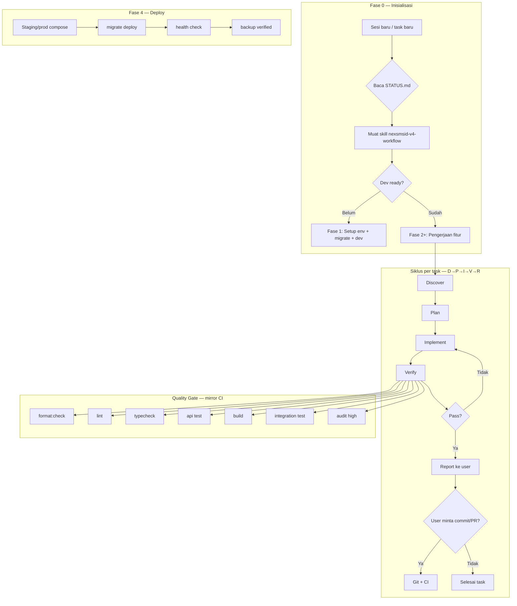
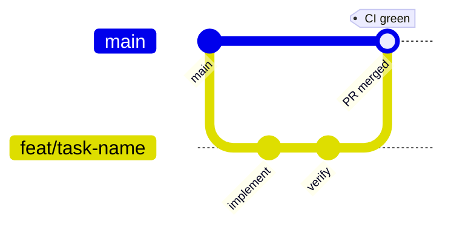

# NexSMSID V4 — Project Workflow

Dokumen workflow utama sebelum dan selama pengerjaan project. **Lokal only.**

## Diagram alur



## Fase project

| Fase  | Nama         | Tujuan                          | Exit criteria                   |
| ----- | ------------ | ------------------------------- | ------------------------------- |
| **0** | Inisialisasi | Skill, workflow, audit baseline | Workflow + STATUS ada           |
| **1** | Dev Ready    | Bisa develop lokal              | `.env`, `pnpm dev`, login OK    |
| **2** | Quality      | Smoke test domain bisnis        | 5 domain lolos                  |
| **3** | Hardening    | Prod readiness                  | Docker audit clean, security OK |
| **4** | Production   | Deploy pilot                    | Prod stack + health + backup    |

Detail checklist: [checklists/](checklists/)  
Rencana rinci: [PLAN.md](PLAN.md)  
Status terkini: [STATUS.md](STATUS.md)  
Roadmap audit: [../audit/ROADMAP.md](../audit/ROADMAP.md)

---

## Siklus per task (D→P→I→V→R)

Setiap perubahan kode mengikuti urutan ini:

### 1. Discover

- Baca `nexsmsid-v4-master` → route ke sub-skill
- Identifikasi layer: API / Web / Prisma / CI / Docker
- Cek modul terkait di `nexsmsid-v4/modules.md`
- Jangan coding sebelum scope jelas

### 2. Plan

- Daftar file yang akan diubah (minimal diff)
- Cek kebutuhan: migration, permission seed, api-client, halaman web
- Untuk task besar (>3 file domain): ringkas plan ke user dulu

### 3. Implement

- Ikuti pola di `nexsmsid-v4` skill:
  - Master data → `BaseMasterDataService`
  - People → `BasePeopleService`
  - `@RequirePermissions` wajib di setiap endpoint protected
  - Response → `apiSuccess()`
- Satu concern per commit logic (tapi commit hanya jika user minta)

### 4. Verify

Jalankan sesuai scope perubahan:

| Scope              | Minimum verify                             |
| ------------------ | ------------------------------------------ |
| API only           | `lint` + `api test` + `typecheck`          |
| Web only           | `lint` + `typecheck` + `build` (web)       |
| Prisma schema      | `prisma migrate` + `build` + `integration` |
| Root/config        | `format:check` + `build`                   |
| **Full (default)** | Seluruh quality gate di bawah              |

**Quality gate penuh** (mirror `.github/workflows/ci.yml`):

```bash
pnpm format:check && pnpm lint && pnpm typecheck
pnpm --filter @nexsmsid/api test
pnpm build
pnpm validate:integration
pnpm audit --audit-level high
```

### 5. Report

- Ringkas apa yang diubah dan hasil verify
- Update `STATUS.md` jika fase berubah
- Commit/PR **hanya** jika user minta eksplisit

---

## Git & CI workflow



| Aturan          | Detail                                        |
| --------------- | --------------------------------------------- |
| Base branch     | `main`                                        |
| Branch naming   | `feat/`, `fix/`, `chore/`, `cursor/`          |
| CI trigger      | Push/PR ke `main`                             |
| Runner          | Self-hosted, label `nexsmsid-v4`              |
| CI services     | `nexsmsid-v4-ci` via `scripts/ci-services.sh` |
| Commit          | Hanya saat user minta                         |
| Push            | Hanya saat user minta                         |
| Force push main | **Dilarang**                                  |

Setelah PR: `gh run list --repo arpayid/nexsmsid-v4 --branch <branch>`

---

## Routing skill per jenis pekerjaan

| Pekerjaan               | Skill                                        |
| ----------------------- | -------------------------------------------- |
| Workflow / fase project | `nexsmsid-v4-workflow` (ini)                 |
| Develop fitur           | `nexsmsid-v4`                                |
| Orchestrasi umum        | `nexsmsid-v4-master`                         |
| Audit                   | `nexsmsid-project-audit`                     |
| NestJS patterns         | `nestjs-best-practices`                      |
| Next.js pages           | `nextjs-app-router-patterns`                 |
| Prisma                  | `prisma-database-setup`, `prisma-client-api` |
| Docker prod             | `docker-expert`, `docker-compose-audit`      |
| CI/GHA                  | `github-actions`                             |
| Security                | `auditing-security`                          |

---

## Bootstrap dev (wajib sebelum Fase 2)

```bash
pnpm install
cp .env.example .env
# JWT_ACCESS_SECRET & JWT_REFRESH_SECRET: openssl rand -base64 64
docker compose up -d
pnpm --filter @nexsmsid/api prisma migrate dev
pnpm --filter @nexsmsid/api prisma db seed
pnpm dev
```

Verifikasi:

- `curl -s http://localhost:4000/api/v1/health`
- Login: `superadmin@nexsmsid.dev` / `ChangeMe123!`
- Buka `http://localhost:3000/admin`

---

## Definisi "selesai"

| Level                  | Artinya                                       |
| ---------------------- | --------------------------------------------- |
| Task selesai           | D→P→I→V→R done, user informed                 |
| Fase selesai           | Semua exit criteria checklist ✅ di STATUS.md |
| Sprint/feature selesai | Smoke test domain terkait + CI hijau          |
| Prod ready             | Fase 4 exit criteria + security audit         |

---

## File workflow

```
.cursor/workflow/
├── WORKFLOW.md          ← dokumen ini
├── PLAN.md              ← rencana kerja rinci per fase
├── STATUS.md            ← fase & blocker terkini
└── checklists/
    ├── phase-0-init.md
    ├── phase-1-dev-ready.md
    ├── phase-2-quality.md
    ├── phase-3-hardening.md
    ├── phase-4-production.md
    └── task-cycle.md
```

Skill agent: `.cursor/skills/nexsmsid-v4-workflow/SKILL.md`
